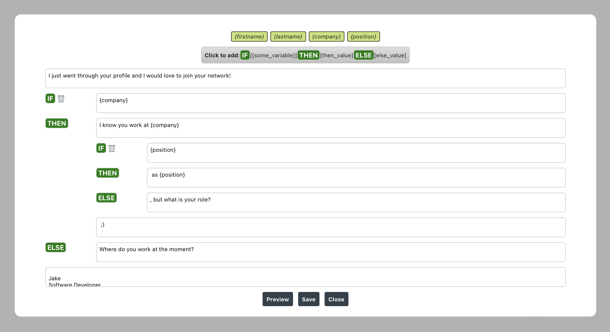
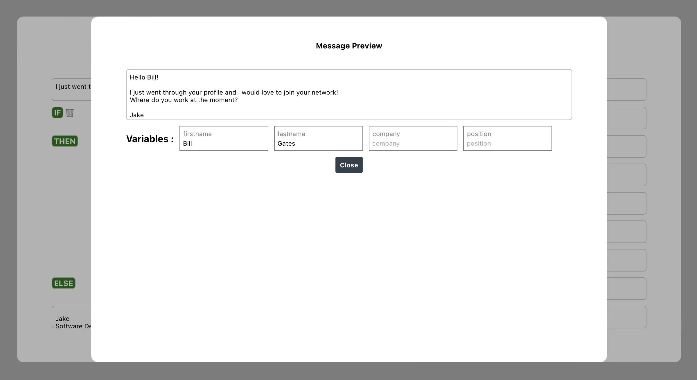
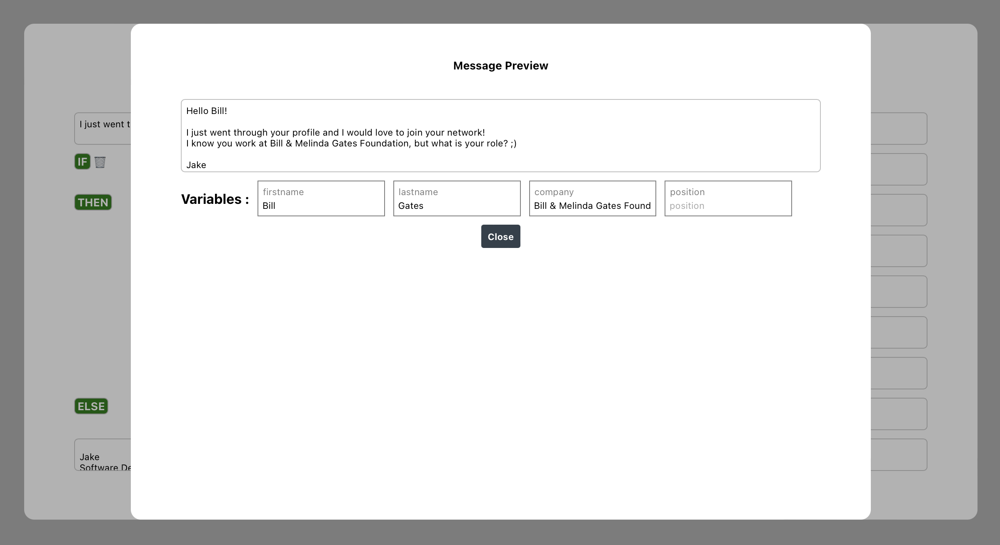
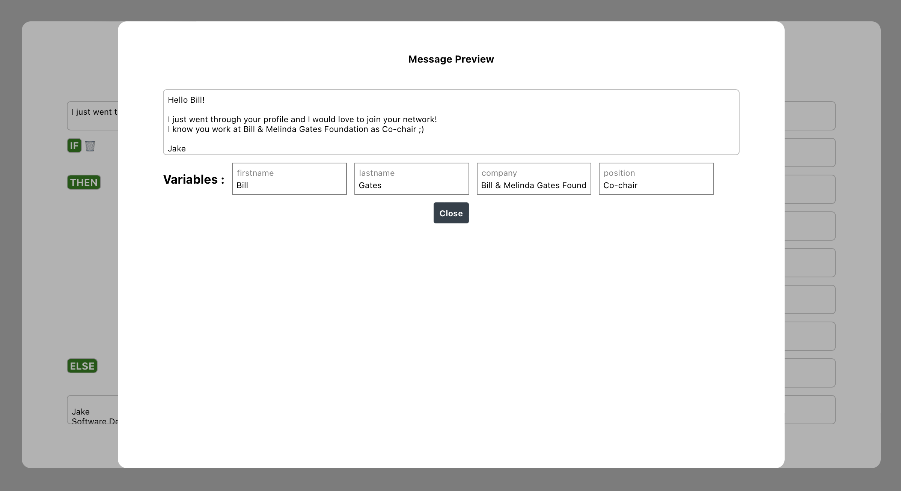

# Message Editor Test Task

Тестовое задание, реализующее создание и использование шаблонов сообщений.

Стек: React v18, TypeScript.

## Установка

```bash
npm install
npm start
```

## Скриншоты

### Виджет редактирования шаблона

- Поддерживает написание переменных в {} скобках

- Поддерживает быстрое добавление переменных в текущую позицию при помощи кнопок

- Поддерживает добавление блока условий:
  
  - Есть возможность вкладывать блоки условий рекурсивно

- Поддерживает сохранение шаблона в localStorage браузера



## Виджет редактирования сообщения

- Отображает сгенерированное сообщение onChange

- Поддерживает ввод значений для переменных

- Обрабатывает блоки условий в зависимости от значений переменных






